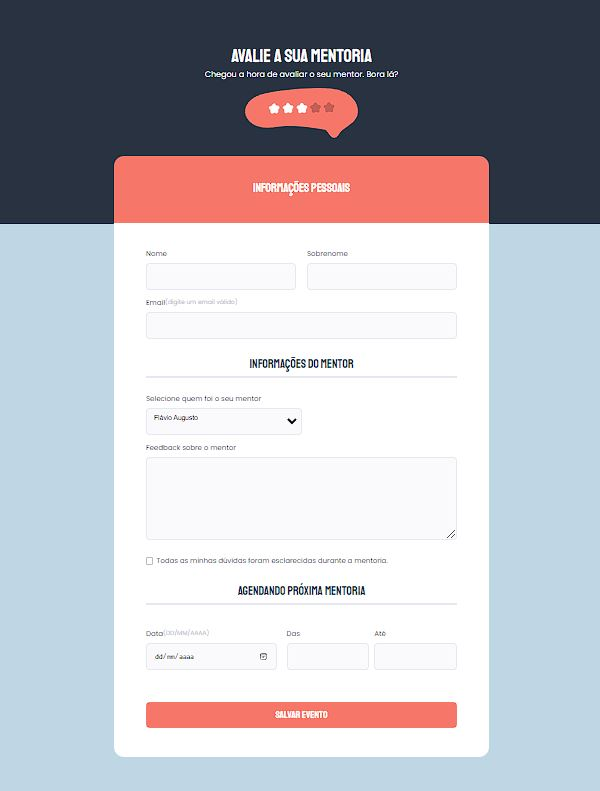

<h1 align="center"> Formulário </h1>

  <a href="#-tecnologias">Tecnologias</a>&nbsp;&nbsp;&nbsp;|&nbsp;&nbsp;&nbsp;
  <a href="#-projeto">Projeto</a>&nbsp;&nbsp;&nbsp;|&nbsp;&nbsp;&nbsp;
  <a href="#-layout">Layout</a>&nbsp;&nbsp;&nbsp;|&nbsp;&nbsp;&nbsp;
  <a href="#memo-licença">Licença</a>

  

 

  

## 🚀 Tecnologias

Esse projeto foi desenvolvido com as seguintes tecnologias:

- HTML
- CSS
- Git e Github
- Figma

## 💻 Projeto

O Formulário é um projeto muito interessante de desenvolver, além de sua aplicação muito importante nos dias atuais.

- [Acesse o projeto finalizado, online](https://villa11rubia.github.io/desafio_formulario_02/)

- [Minhas redes sociais](https://linktr.ee/villaRubia)

## 🔖 Layout

Você pode visualizar o layout do projeto através [DESSE LINK](https://www.figma.com/file/YoLW9OF4m64MbqxpoGbFGN/Stage-03---Formul%C3%A1rio-avan%C3%A7ado-(Copy)?t=VM2N2L47N9KRGt1k-6). É necessário ter conta no [Figma](https://figma.com) para acessá-lo.

##  Licença

Esse projeto está sob a licença MIT.

---

Feito com ♥ by Villa Rubia.
